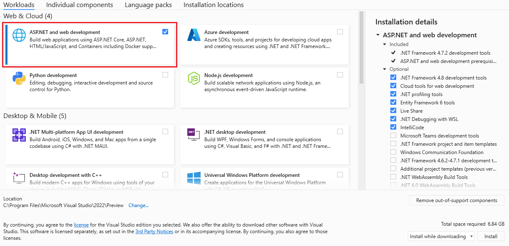
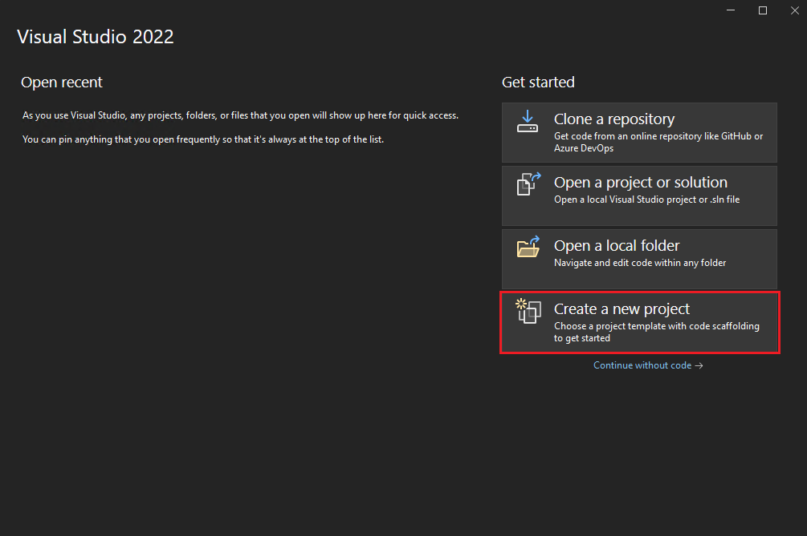
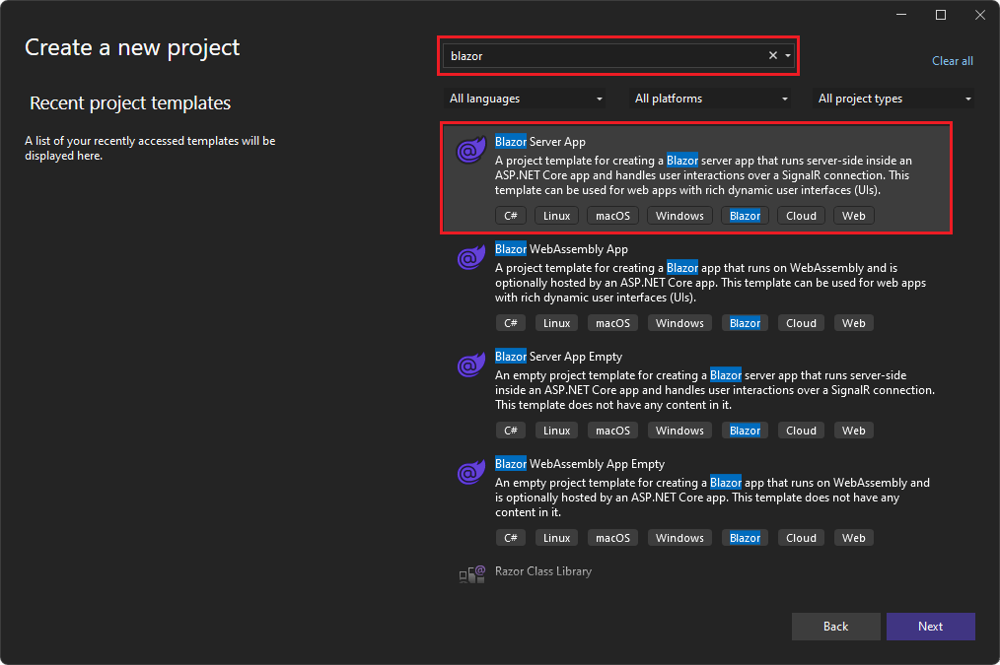
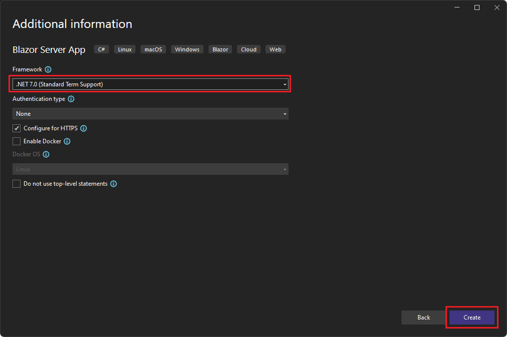
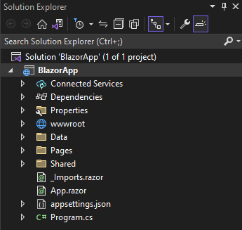
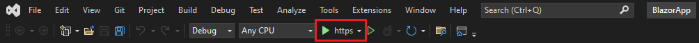
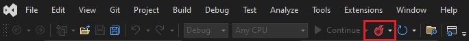
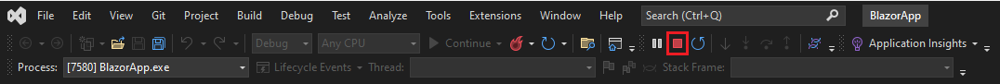
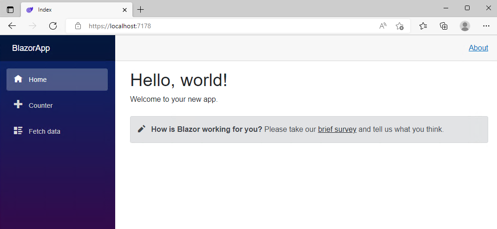
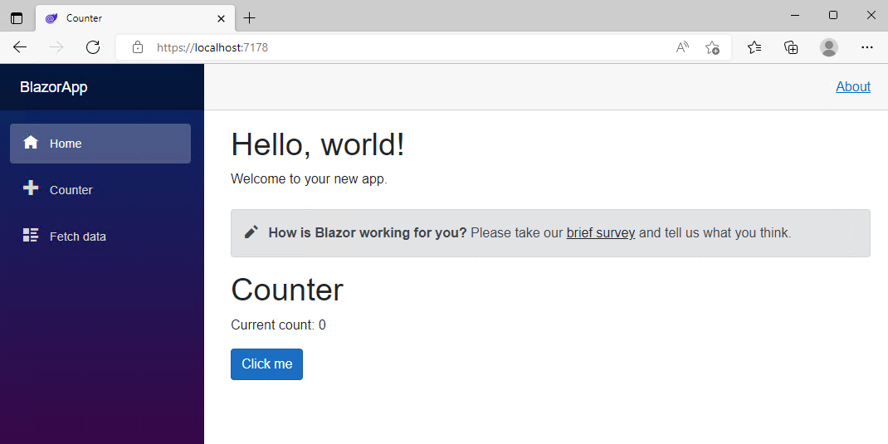

# اولین برنامه Blazor خود را بسازید


**ویژوال استودیو 2022 را دانلود و نصب کنید**



**آیا از قبل Visual Studio 2022 دارید؟**

اگر از قبل Visual Studio 2022 دارید، می توانید ASP.NET و web development را اضافه کنید:

- کلید Windows را انتخاب کنید، Visual Studio Installer را تایپ کنید و Enter را فشار دهید.
- اگر از شما خواسته شد، به نصب کننده اجازه دهید خودش را به روز کند.
- اگر بروزرسانی برای ویژوال استودیو 2022 در دسترس باشد، دکمه Update نشان داده می شود. قبل از تغییر نصب، آن را برای به روز رسانی انتخاب کنید.
- نصب Visual Studio 2022 خود را پیدا کنید و دکمه Modify را انتخاب کنید.
- اگر قبلاً انتخاب نشده‌اید، ASP.NET و web development را انتخاب کرده و دکمه Modify را انتخاب کنید. در غیر این صورت، فقط پنجره را ببندید.

## ایجاد برنامه جدید

1. ویژوال استودیو را راه اندازی کنید و Create a new project را انتخاب کنید.



2. در پنجره Create a new project کلمه Blazor را در کادر جستجو تایپ کرده و Enter را بزنید.
3. قالب Blazor Server App را انتخاب کرده و Next را انتخاب کنید.



4. در پنجره Configure your new project، نام BlazorApp را به عنوان نام پروژه وارد کرده و Next را انتخاب کنید.
5. در پنجره اطلاعات اضافی، .NET 7.0 (Standard Term Support) را درمنو کشویی Framework در صورتی که قبلاً انتخاب نکرده اید انتخاب کنید و روی دکمه Create کلیک کنید.




پروژه شما در ویژوال استودیو ایجاد و بارگذاری می شود. با استفاده از Solution Explorer به محتویات پروژه خود نگاهی بیندازید.




چندین فایل ایجاد شد تا یک برنامه ساده Blazor را به شما ارائه دهد که آماده اجرا است.

- فایل Program.cs نقطه ورود برنامه‌ای است که سرور را راه‌اندازی می‌کند و در آن سرویس‌های برنامه و میان‌افزار را پیکربندی می‌کنید.
- فایل App.razor جزء اصلی برنامه است.
- دایرکتوری pages شامل چند صفحه وب نمونه برای برنامه است.
- فایل BlazorApp.csproj پروژه برنامه و وابستگی های آن را تعریف می کند و با دوبار کلیک کردن بر روی گره پروژه BlazorApp در Solution Explorer قابل مشاهده است.
- فایل launchSettings.json در دایرکتوری Properties تنظیمات پروفایل متفاوتی را برای محیط توسعه محلی تعریف می کند. یک شماره پورت به طور خودکار هنگام ایجاد پروژه اختصاص داده می شود و در این فایل ذخیره می شود.

## اجرا  برنامه

روی دکمه Start Debugging (فلش سبز رنگ) در نوار ابزار Debug در ویژوال استودیو کلیک کنید تا برنامه شما اجرا شود.




پس از اجرای برنامه، می توانید با کلیک روی دکمه Hot Reload تغییرات کد را در برنامه در حال اجرا اعمال کنید.



با کلیک بر روی دکمه Stop در نوار ابزار بالا، می توانید برنامه را در هر زمانی متوقف کنید.



اولین باری که یک برنامه وب را در ویژوال استودیو اجرا می کنید، یک گواهی توسعه برای میزبانی برنامه از طریق HTTPS تنظیم می کند و سپس از شما می خواهد به گواهی اعتماد کنید. توصیه می کنیم با اعتماد به گواهی موافقت کنید. این گواهی تنها برای توسعه محلی استفاده خواهد شد و بدون آن اکثر مرورگرها از امنیت وب سایت شکایت خواهند کرد.

منتظر بمانید تا برنامه در مرورگر راه اندازی شود. هنگامی که به صفحه زیر رسیدید، اولین برنامه Blazor خود را با موفقیت اجرا کردید!



صفحه نمایش داده شده توسط فایل `Index.razor `واقع در دایرکتوری Pages تعریف می شود. محتوای آن به این صورت است:

```C#

@page "/"

<PageTitle>Index</PageTitle>

<h1>Hello, world!</h1>

Welcome to your new app.

<SurveyPrompt Title="How is Blazor working for you?" />
```

قبلاً حاوی کدی است که آن را به عنوان صفحه اصلی تنظیم می کند و متن Hello, world را نمایش می دهد! و به برنامه جدید خود خوش آمدید. همچنین شامل یک کامپوننت SurveyPrompt است که لینکی به نظرسنجی فیدبک Blazor رندرمی کند.

## شمارنده را امتحان کنید

در برنامه در حال اجرا، با کلیک بر روی تب Counter در نوار کناری سمت چپ، به صفحه شمارنده بروید. سپس صفحه زیر باید نمایش داده شود:


دکمه Click_me را انتخاب کنید تا شمارنده بدون رفرش صفحه افزایش یابد. افزایش شمارنده در یک صفحه وب معمولاً نیاز به نوشتن جاوا اسکریپت دارد، اما با Blazor می توانید از سی شارپ استفاده کنید.

می توانید اجرای مولفه Counter را در فایل Counter.razor واقع در دایرکتوری Pages بیابید.

```C#

@page "/counter"

<PageTitle>Counter</PageTitle>

<h1>Counter</h1>

<p role="status">Current count: @currentCount</p>

<button class="btn btn-primary" @onclick="IncrementCount">Click me</button>

@code {
    private int currentCount = 0;

    private void IncrementCount()
    {
        currentCount++;
    }
}
```

درخواست برای آدرس /counter در مرورگر، همانطور که توسط دستورالعمل صفحه @ در بالا مشخص شده است، باعث می شود مولفه Counter محتوای خود را رندر کند.

هر بار که دکمه Click_me انتخاب می شود:

- رویداد onclick فعال می شود.
- متد IncrementCount فراخوانی می شود.
- مقدار currentCount افزایش می یابد.
- کامپوننت برای نمایش شمارنده به روز شده رندر می شود


## اضافه کردن یک کامپوننت

هر یک از فایل‌های .razor یک کامپوننت رابط کاربری را تعریف می‌کند که می‌تواند مجدداً استفاده شود.

فایل Index.razor را در ویژوال استودیو باز کنید. فایل Index.razor از قبل وجود دارد و زمانی که پروژه را ایجاد کردید ایجاد شد. در پوشه Pages در دایرکتوری BlazorApp قرار دارد که قبلا ایجاد شده بود.

با افزودن عنصر `<Counter />` در انتهای فایل Index.razor، یک کامپوننت Counter را به صفحه اصلی برنامه اضافه کنید.

```C# 

@page "/"

<PageTitle>Index</PageTitle>

<h1>Hello, world!</h1>

Welcome to your new app.

<SurveyPrompt Title="How is Blazor working for you?" />

<Counter />
```

روی دکمه Hot Reload کلیک کنید تا تغییر را در برنامه در حال اجرا اعمال کنید. سپس کامپوننت Counter در صفحه اصلی نمایش داده می شود.



## تغییر یک کامپوننت

پارامترهای کامپوننت با استفاده از ویژگی ها یا محتوای child مشخص می شوند، که به شما امکان می دهد ویژگی های کامپوننت فرزند را تنظیم کنید. پارامتری را بر روی کامپوننت Counter برای تعیین میزان افزایش آن با هر کلیک بر روی دکمه تعریف کنید:

- یک ویژگی عمومی برای IncrementAmount با ویژگی `[Parameter]` اضافه کنید.
- متد IncrementCount را تغییر دهید تا از IncrementAmount هنگام افزایش مقدار currentCount استفاده کنید.

کد زیر نحوه دستیابی به آن را نشان می دهد.

```C#

@page "/counter"

<PageTitle>Counter</PageTitle>

<h1>Counter</h1>

<p>Current count: @currentCount</p>

<button class="btn btn-primary" @onclick="IncrementCount">Click me</button>

@code {
    private int currentCount = 0;

    [Parameter]
    public int IncrementAmount { get; set; } = 1;

    private void IncrementCount()
    {
        currentCount += IncrementAmount;
    }
}
```

در Index.razor، به عنصر <Counter> یک ویژگی IncrementAmount اضافه کنید که مقدار افزایش را به ده تغییر می‌دهد:

```C#

@page "/"

<h1>Hello, world!</h1>

Welcome to your new app.

<SurveyPrompt Title="How is Blazor working for you?" />

<Counter IncrementAmount="10" />
```

با کلیک روی دکمه Hot Reload، تغییر را در برنامه اعمال کنید. کامپوننت Index اکنون شمارنده مخصوص به خود را دارد که هر بار که دکمه `Click me` را انتخاب می‌کنید ده شماره افزایش می‌یابد، همانطور که در تصویر زیر نشان داده شده است. کامپوننت `Counter` `(Counter.razor) `در `/counter` همچنان یک افزایش می یابد.

تبریک می‌گوییم، شما اولین برنامه Blazor خود را ساخته و اجرا کرده‌اید!

**منبع:**

[Blazor Tutorial - Build your first Blazor app](https://dotnet.microsoft.com/en-us/learn/aspnet/blazor-tutorial/intro)