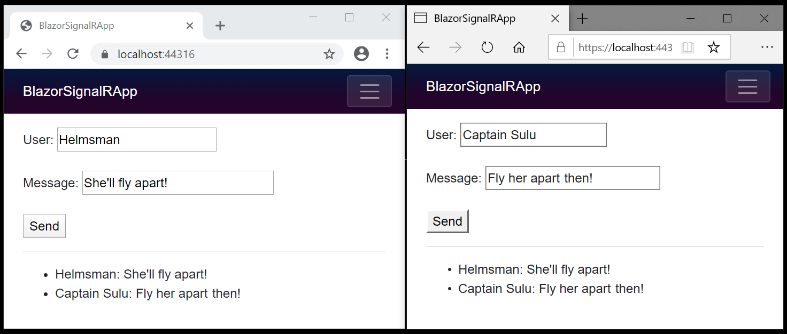

# استفاده ASP.NET Core SignalR با Blazor

این آموزش یک تجربه کاری اولیه برای ساختن یک برنامه real_time با استفاده از SignalR با Blazor ارائه می دهد.

یاد بگیرید چگونه:

یک پروژه Blazor ایجاد کنید
اضافه کردن کتابخانه SignalR client
اضافه  کردن SignalR hub
اضافه  کردن SignalR services و endpoint را برای SignalR hub
اضافه  کردن کد کامپوننت Razor برای چت
در پایان این آموزش، یک برنامه چت فعال خواهید داشت

## ایجاد یک برنامه Blazor Server

راهنمایی را برای انتخاب ابزار خود دنبال کنید:


  **توجه داشته باشید**

ویژوال استودیو2022 یا جدیدتر و NET Core SDK 6.0.0 یا بالاتر مورد نیاز است.

یک پروژه جدید ایجاد کنید.

قالب برنامه سرور Blazor را انتخاب کنید. Next را انتخاب کنید.

BlazorServerSignalRApp را در قسمت نام پروژه تایپ کنید. تأیید کنید که ورودی لوکیشن صحیح است یا مکانی برای پروژه ارائه دهید. Next را انتخاب کنید.

Create را انتخاب کنید.

## اضافه کردن کتابخانه SignalR client

در **Solution Explorer**، روی پروژه `BlazorServerSignalRApp` راست کلیک کرده و **Manage NuGet Packages** را انتخاب کنید.

در پنجره **Manage NuGet Packages**، تأیید کنید که **Package source** روی `nuget.org` تنظیم شده است.

با انتخاب مرورگر، `Microsoft.AspNetCore.SignalR.Client` را در کادر جستجو تایپ کنید.

در نتایج جستجو، بسته Microsoft.AspNetCore.SignalR.Client را انتخاب کنید. نسخه را طوری تنظیم کنید که با shared framework برنامه مطابقت داشته باشد. **Install** را انتخاب کنید.

اگر **پیش نمایش** تغییرات ظاهر شد، **OK** را انتخاب کنید.

اگر کادر گفتگوی پذیرش مجوز ظاهر شد، در صورت موافقت با شرایط مجوز، **I Accept** را انتخاب کنید.

## اضافه کردن SignalR hub 

یک پوشه `Hubs` (plural) ایجاد کنید و کلاس `ChatHub` زیر را اضافه کنید `(Hubs/ChatHub.cs)`:

```C#

using Microsoft.AspNetCore.SignalR;

namespace BlazorServerSignalRApp.Server.Hubs;

public class ChatHub : Hub
{
    public async Task SendMessage(string user, string message)
    {
        await Clients.All.SendAsync("ReceiveMessage", user, message);
    }
}
```

##  اضافه کردن سرویس ها و یک endpoint را برای SignalR hub

فایل `Program.cs` را باز کنید.

فضای نام Microsoft.AspNetCore.ResponseCompression و کلاس `ChatHub` را به بالای فایل اضافه کنید:

```C#

using Microsoft.AspNetCore.ResponseCompression;
using BlazorServerSignalRApp.Server.Hubs;
```

سرویس Response Compression Middleware را اضافه کنید:

```C#

builder.Services.AddResponseCompression(opts =>
{
    opts.MimeTypes = ResponseCompressionDefaults.MimeTypes.Concat(
          new[] { "application/octet-stream" });
});
```

از Response Compression Middleware در بالای پیکربندی processing pipeline استفاده شود:

```C#
app.UseResponseCompression();
```

بین endpoint ها برای MapBlazorHub و fallback سمت کلاینت، بلافاصله بعد از خط ()app.MapBlazorHub یک endpoint برای هاب اضافه کنید.

```C#
app.MapHub<ChatHub>("/chathub");
```

## اضافه کردن کد Razor component را برای چت

فایل `Pages/Index.razor` را باز کنید.

کد زیر را جایگزین کنید:

```C#
@page "/"
@using Microsoft.AspNetCore.SignalR.Client
@inject NavigationManager Navigation
@implements IAsyncDisposable

<PageTitle>Index</PageTitle>

<div class="form-group">
    <label>
        User:
        <input @bind="userInput" />
    </label>
</div>
<div class="form-group">
    <label>
        Message:
        <input @bind="messageInput" size="50" />
    </label>
</div>
<button @onclick="Send" disabled="@(!IsConnected)">Send</button>

<hr>

<ul id="messagesList">
    @foreach (var message in messages)
    {
        <li>@message</li>
    }
</ul>

@code {
    private HubConnection? hubConnection;
    private List<string> messages = new List<string>();
    private string? userInput;
    private string? messageInput;

    protected override async Task OnInitializedAsync()
    {
        hubConnection = new HubConnectionBuilder()
            .WithUrl(Navigation.ToAbsoluteUri("/chathub"))
            .Build();

        hubConnection.On<string, string>("ReceiveMessage", (user, message) =>
        {
            var encodedMsg = $"{user}: {message}";
            messages.Add(encodedMsg);
            InvokeAsync(StateHasChanged);
        });

        await hubConnection.StartAsync();
    }

    private async Task Send()
    {
        if (hubConnection is not null)
            {
                await hubConnection.SendAsync("SendMessage", userInput, messageInput);
            }
    }

    public bool IsConnected =>
        hubConnection?.State == HubConnectionState.Connected;

    public async ValueTask DisposeAsync()
    {
        if (hubConnection is not null)
        {
            await hubConnection.DisposeAsync();
        }
    }
}
```

**توجه داشته باشید**

هنگام استفاده از Hot Reload، پاسخ Response Compression Middleware را در محیط توسعه غیرفعال کنید. برای اطلاعات بیشتر، به راهنمای [ASP.NET Core Blazor SignalR](https://learn.microsoft.com/en-us/aspnet/core/blazor/fundamentals/signalr?view=aspnetcore-7.0#disable-response-compression-for-hot-reload) مراجعه کنید.


## برنامه را اجرا کنید

آدرس URL را از نوار آدرس کپی کنید، نمونه یا برگه مرورگر دیگری را باز کنید و URL را در نوار آدرس جای‌گذاری کنید.


یکی از مرورگرها را انتخاب کنید، یک نام و پیام وارد کنید و دکمه ارسال پیام را انتخاب کنید. نام و پیام بلافاصله در هر دو صفحه نمایش داده می شود:



در این آموزش شما یاد گرفتید که چگونه:

یک پروژه Blazor ایجاد کنید
کتابخانه SignalR client را اضافه کنید
SignalR hub اضافه کنید
SignalR services و endpoint را برای SignalR hub اضافه کنید
کد Razor component را برای چت اضافه کنید

**منبع:**

[https://learn.microsoft.com/en-us/aspnet/core/blazor/tutorials/signalr-blazor?view=aspnetcore-7.0&tabs=visual-studio&pivots=server](https://learn.microsoft.com/en-us/aspnet/core/blazor/tutorials/signalr-blazor?view=aspnetcore-7.0&tabs=visual-studio&pivots=server)