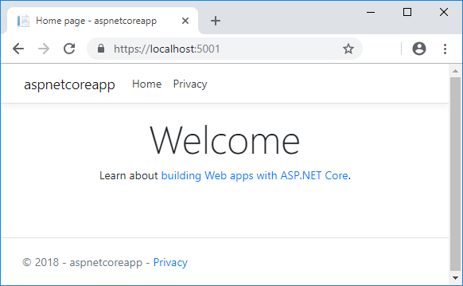

# شروع کار با ASP.NET Core

این آموزش نحوه ایجاد و اجرای یک برنامه وب ASP.NET Core را با استفاده از NET Core CLI نشان می دهد.

- شما یاد خواهید گرفت که چگونه:
- یک پروژه برنامه وب ایجاد کنید.
- اعتبار گواهی توسعه 
- برنامه را اجرا کنید.
- یک صفحه Razor را ویرایش کنید

در پایان، یک برنامه وب در حال اجرا در دستگاه لوکال خود خواهید داشت.



## یک پروژه برنامه وب ایجاد کنید

یک command_shell باز کنید و دستور زیر را وارد کنید:

```C#

dotnet new webapp -o aspnetcoreapp
```

دستور قبلی:

یک برنامه وب جدید ایجاد می کند.
پارامتر `-o aspnetcoreapp` یک دایرکتوری به نام `aspnetcoreapp` با فایل های سورس برای برنامه ایجاد می کند.

## گواهی توسعه مطمئن
گواهی توسعه HTTPS

```C#

dotnet dev-certs https --trust
```

دستور قبلی دیالوگ زیر را نمایش می دهد:


در صورتی که موافقید *Yes* را بزنید


## برنامه را اجرا کنید

دستورات زیر را اجرا کنید:

```C#

cd aspnetcoreapp
dotnet watch run
```

پس از اینکه command shell نشان داد که برنامه شروع شده است، به h`ttps://localhost:{port}` بروید، جایی که `{port}` پورت تصادفی مورد استفاده است.

## ویرایش Razor Page  

فایل Pages/Index.cshtml را باز کنید و  با کدهای زیر جایگزین و ذخیره کنید

```C#

@page
@model IndexModel
@{
    ViewData["Title"] = "Home page";
}

<div class="text-center">
    <h1 class="display-4">Welcome</h1>
    <p>Hello, world! The time on the server is @DateTime.Now</p>
</div>
```

به `https://localhost:{port}` مراجعه کنید، صفحه را بازخوانی کنید و بررسی کنید که تغییرات نمایش داده شده است.